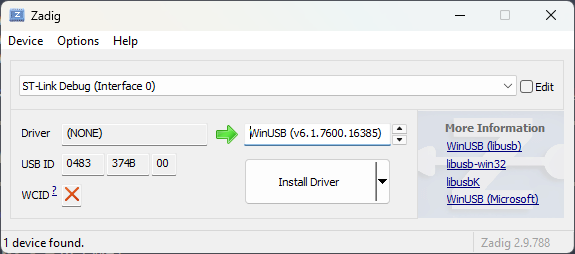
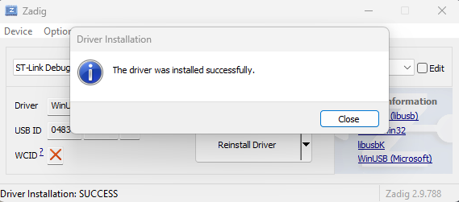

# MCUHex SDK

MCUHex SDK is the local backend that connects the [MCUHex](https://mcuhex.com/) web app to physical debug probes. It runs on the developer's machine as a lightweight **WebSocket server** (default `ws://127.0.0.1:8765`) and exposes a single JSON protocol the web app drives to talk to the target MCU.

Through that protocol the SDK provides:

- **Memory access** — read and write arbitrary addresses on the target.
- **Live signal capture** — sample one or more variables/registers at a fixed rate and stream the buffered result back.
- **Firmware flashing** — program `.elf` / `.out` / images with live progress, with CMSIS-Pack discovery and install for target support.
- **Device & target management** — enumerate attached probes, auto-select the matching driver, and override the target chip.

It connects to **ARM Cortex-M** targets over **SWD** using [PyOCD](https://pyocd.io/). The SDK also ships as a small **tray application** for macOS and Windows that manages the server lifecycle and auto-updates. On Linux, and anywhere you would rather run it yourself, see [Run from source](#run-from-source).

## Connectivity Support

> [!NOTE]
> **Only the ARM Cortex-M (SWD) path is supported today.** Drivers for OCD (STM32G4) and serial transports are out-of-tree and planned for future releases.

| Transport | Targets | Driver | Status |
| :--- | :--- | :--- | :---: |
| **SWD** | ARM Cortex-M | PyOCD | ✅&nbsp; **Supported** |
| OCD | STM32 family | — | 🚧&nbsp; Planned |
| Serial / UART | TI C2000, ESP32 / Espressif | — | 🚧&nbsp; Planned |

<sub>✅ Available now &nbsp;·&nbsp; 🚧 On the roadmap — not yet wired in</sub>

## Run from source

The tray app for macOS and Windows is this same server wrapped in a menu-bar
icon. Running from source gives you everything the tray app does, and it is the
supported path on Linux, where there is no packaged build.

Requires **Python 3.9 or newer**. Verified on 3.11, 3.13 and 3.14.

### 1. Platform prerequisites

<details open>
<summary><b>Linux</b> (Debian / Ubuntu)</summary>

```bash
sudo apt install python3-venv libusb-1.0-0 libhidapi-hidraw0
```

USB debug probes are root-only until a udev rule grants your user access.
Without the rules the probe enumerates but cannot be claimed, and the SDK
reports `PERMISSION_DENIED`. The rules ship in this repository's `udev/`
directory (pyOCD's set: ST-Link, CMSIS-DAP and a few others); step 2 installs
them once the repository is cloned. J-Link brings its own rule with SEGGER's
software pack, which it needs on Linux regardless.

If you also use the board's virtual COM port, add yourself to the serial group
and log back in:

```bash
sudo usermod -aG dialout $USER
```

</details>

<details>
<summary><b>macOS</b> (Apple Silicon and Intel)</summary>

No extra system packages. `libusb-package` in `requirements.txt` carries the
libusb binary, and hidapi ships as a wheel.

</details>

<details>
<summary><b>Windows</b> (x64)</summary>

No extra system packages: libusb and hidapi both install as wheels.

Driver notes per probe:

- **ST-Link** — pyOCD reaches it through WinUSB. If STM32CubeIDE or STM32CubeProgrammer is installed, its driver already binds WinUSB and there is nothing to do. Otherwise plug the probe in and, if it does not appear in the device list, open [Zadig](https://zadig.akeo.ie/). It lists the driverless probe on startup (Options → List All Devices only if it is missing). The name comes from the probe itself: `ST-Link Debug (Interface 0)` for the ST-Link on a Nucleo or Discovery board, `STM32 STLink` for a stand-alone ST-Link V2 dongle; either way the USB ID column starts with 0483. Make sure the arrow points at WinUSB, click Install Driver, then replug. If you later install ST's tools and they stop seeing this probe, reinstall ST's driver package.

  
  

- **J-Link** — install the [SEGGER J-Link software pack](https://www.segger.com/downloads/jlink/), which provides the driver and the DLL `pylink-square` loads.

</details>

### 2. Install

<details open>
<summary><b>Linux and macOS</b></summary>

```bash
git clone https://github.com/omrdk/mcuhex-sdk.git
cd mcuhex-sdk
python3 -m venv .venv
source .venv/bin/activate
pip install -r requirements.txt
```

Linux only — install the udev rules, then unplug and replug the probe:

```bash
sudo cp udev/*.rules /etc/udev/rules.d/
sudo udevadm control --reload && sudo udevadm trigger
```

</details>

<details>
<summary><b>Windows</b> (PowerShell)</summary>

```powershell
git clone https://github.com/omrdk/mcuhex-sdk.git
cd mcuhex-sdk
py -m venv .venv
Set-ExecutionPolicy -ExecutionPolicy RemoteSigned -Scope Process
.venv\Scripts\Activate.ps1
pip install -r requirements.txt
```

PowerShell refuses to run the activation script under the default execution
policy, with *"running scripts is disabled on this system"*. The line above
lifts that for the current window only — close it and the machine's policy is
untouched. From `cmd.exe` instead of PowerShell, run `.venv\Scripts\activate.bat`
and skip that line.

</details>

### 3. Start the server

Connect your probe over USB, then run the same command on every platform:

```bash
python server.py --probe PyOCDProbe
```

Leave the terminal open — this process owns the probe for as long as you are
working.

### 4. Connect from the browser

Open [mcuhex.com/monitor](https://mcuhex.com/monitor). The web app dials
`ws://127.0.0.1:8765` by itself, so there is nothing to paste or configure. The
page is served over HTTPS but the socket is plain `ws://`; browsers allow this
because loopback counts as a trusted origin.

Keep the default port. The web app has no setting for a different one, so a
server started with `--port` will not be found. If the browser cannot reach a
server that is clearly running, bind the loopback address explicitly:

```bash
python server.py --probe PyOCDProbe --host 127.0.0.1
```

The server only accepts WebSocket handshakes from an allow-list of origins
(`desktop/config.py`), so no other site you happen to have open can drive your
probe. Clients that send no `Origin` header at all — the CLI below, the VS Code
extension — are also accepted, which no web page can imitate.

## Quick Start

```bash
# Mock an ARM Cortex-M device (no hardware needed)
python mock_device.py cortex_m

# Mock with no simulated read delay (instant reads)
python mock_device.py cortex_m --fast

# Real hardware via the PyOCD driver (ARM Cortex-M over SWD)
python mock_device.py -t pyocd

# Run the server directly with a specific probe class
python server.py --probe PyOCDProbe

# Interactive CLI client
python client.py
```

## `mock_device.py` Launcher

Despite its name, `mock_device.py` is a universal launcher that starts the server in either **Mock** mode or **Real Hardware** mode.

```text
usage: mock_device.py [-h] [-f MOCK_FILE] [-t {mock,pyocd}] [--debug] [-P PORT]
                      [-s SCENARIO] [--fast] ...
                      [{cortex_m}]
```

| Argument | Description |
| :--- | :--- |
| `{cortex_m}` | **Device family profile** (mock mode): `cortex_m` (ARM SWD). Sets the simulated device identity. |
| `-t`, `--type` | **Driver type**: `mock` (default, simulation) or `pyocd` (ARM Cortex-M over SWD). |
| `-f`, `--file` | **Custom file** (mock only): path to a JSON symbol/memory file. |
| `-P`, `--port` | WebSocket server port (default: `8765`). |
| `--fast` | Disable the simulated read delay in mock mode (instant reads). |
| `--debug` | Enable verbose logging. |
| `--mock-wave-freq` / `--mock-wave-amp` | Tune the mock waveform generator (Hz / amplitude). |
| `--vid` / `--pid` / `--manufacturer` / `--product` / `--serial` / `--device-path` | Override the simulated USB device descriptors. |

## `server.py` (Direct)

Run the server directly and choose the initial probe class:

```bash
python server.py --probe {PyOCDProbe,DummyProbe} [--port 8765] [--debug]
```

## Architecture

```
server.py               WebSocket server, CommandHandler, ErrorCode, PROBE_MAP
mock_device.py          Universal launcher (mock + real hardware)
client.py               Interactive CLI client

probe/
  debugprobe.py         DebugProbe abstract base
  dummyprobe.py         Mock/simulator + waveform generation + scenario injection
  pyocd_probe.py        PyOCD driver (ARM Cortex-M over SWD)
  remoteprobe.py        Remote proxy
  errors.py             ProbeError

desktop/                pystray tray app, auto-update, build scripts (macOS + Windows)
firmware/               Demo firmware used by the mock profile data
```

Drivers are loaded individually in `probe/__init__.py`; a missing native dependency (e.g. `serial`, `pyocd`) logs a warning and skips that driver rather than failing the whole import.

## WebSocket Protocol

All communication is JSON over a single WebSocket connection. Every request carries a `cmd` and an optional client-chosen `id`; the server echoes that `id` back so the client can match responses to requests.

### Message envelopes

```jsonc
// Request  (client → server)
{ "cmd": "<command>", "id": <number>, /* ...command-specific args */ }

// Success response  (server → client)
{ "version": 1, "sdk_version": "x.y.z", "status": 0, "id": <number>, /* ...data */ }

// Error response  (server → client)
{ "version": 1, "sdk_version": "x.y.z", "status": 1, "error_code": "<CODE>", "msg": "<human readable>" }
```

- `status` is `0` on success and `1` on error.
- On error, `error_code` is a stable machine-readable string (see [Error codes](#error-codes)) and `msg` is a human-readable explanation.
- Long-running commands (`capture`, `flash`, `install_pack`) return immediately with an acknowledgement, then **push** progress/completion messages identified by a `type` field (see [Async push messages](#async-push-messages)).

### Command reference

| Command | Required args | Optional args | Success payload |
| :--- | :--- | :--- | :--- |
| `list_devices` | — | — | `{ devices: [...] }` (+ `demo`, `demo_registers` in demo mode) |
| `list_probes` | — | — | `{ probes: [...], active_probe }` |
| `set_probe` | `probe_name` | — | `{ msg }` |
| `enter_demo` | — | — | `{ demo: true, ... }` |
| `get_driver_list` | — | — | `{ drivers: [...] }` |
| `connect` | `uri` | `target` | `{ is_open, target? }` |
| `disconnect` | — | — | `{ is_open }` |
| `read` | `addr`, `nb` | — | `{ data: "<hex>" }` |
| `write` | `addr`, `data` (hex) | — | `{}` (status only) |
| `calibrate` | — | — | `{ per_read_ms }` |
| `capture` | `channels`, `rate_hz`, `duration_s` | — | `{ msg: "capture_started" }` → async `capture_complete` |
| `stop_capture` | — | — | `{ msg }` |
| `browse_files` | — | `directory`, `extensions` | `{ directory, parent, entries }` (restricted to `$HOME`) |
| `flash` | `file_path` | `chip_erase`, `verify`, `no_reset` | `{ msg: "flash_started" }` → async `flash_progress` / `flash_complete` |
| `cancel_flash` | — | — | `{ msg }` |
| `search_targets` | — | `query`, `limit` | `{ results: [...], total }` |
| `install_pack` | `target` | — | `{ msg }` → async progress |
| `set_target` | `uri` | `target` | `{ msg, uri, target? }` |
| `get_target_info_ext` | — | — | `{ target_override, overrides, detected?, memory_map }` |

> `read` returns memory as a hex string; `write` takes `data` as a hex string. `channels` is a list of `{ addr, nb, type }` objects (see [Data encoding](#data-encoding) for `type`).

### Examples

```jsonc
// read 4 bytes at 0x20000000
→ { "cmd": "read", "id": 7, "addr": 536870912, "nb": 4 }
← { "version": 1, "sdk_version": "1.2.3", "status": 0, "id": 7, "data": "39300000" }

// connect to a probe that isn't there
→ { "cmd": "connect", "id": 8, "uri": "pyocd:0x0483" }
← { "version": 1, "sdk_version": "1.2.3", "status": 1,
    "error_code": "NO_DEVICES_FOUND", "msg": "No debug probes found" }
```

### Async push messages

These are emitted by the server without a matching request `id`; clients dispatch on `type`.

```jsonc
// capture finished — buffered samples streamed back at once
{ "type": "capture_complete", "capture_id": <id>,
  "samples": [[t, v1, v2, ...], ...], "actual_hz": <float>, "total_samples": <int> }

// flash progress (repeated; phase ∈ "erasing" | "programming" | "verifying")
{ "type": "flash_progress", "flash_id": <id>, "phase": "programming", "progress": 0.62 }

// flash finished — success
{ "type": "flash_complete", "flash_id": <id>, "success": true,
  "duration_ms": <int>, "bytes_programmed": <int> }

// flash finished — failure
{ "type": "flash_complete", "flash_id": <id>, "success": false,
  "error_code": "<CODE>", "msg": "<...>" }
```

### Error codes

`error_code` values are grouped by category — generic connection ([`NO_DEVICES_FOUND`](https://mcuhex.com/troubleshooting/no-debug-probe-detected), [`DEVICE_BUSY`](https://mcuhex.com/troubleshooting/device-busy), [`PERMISSION_DENIED`](https://mcuhex.com/troubleshooting/usb-permission-denied), [`CONNECT_TIMEOUT`](https://mcuhex.com/troubleshooting/connect-timeout), [`READ_WRITE_FAILED`](https://mcuhex.com/troubleshooting/memory-read-write-failed), …), Cortex-M specific ([`CORTEX_M_DEBUG_PORT_LOCKED`](https://mcuhex.com/troubleshooting/debug-port-locked), [`CORTEX_M_SWD_PROTOCOL_ERROR`](https://mcuhex.com/troubleshooting/swd-protocol-error), …), flash operations ([`FLASH_FILE_NOT_FOUND`](https://mcuhex.com/troubleshooting/firmware-file-not-found), [`FLASH_UNSUPPORTED_FORMAT`](https://mcuhex.com/troubleshooting/unsupported-firmware-format), [`FLASH_VERIFICATION_FAILED`](https://mcuhex.com/troubleshooting/flash-verification-failed), [`CORTEX_M_FLASH_WRITE_PROTECTED`](https://mcuhex.com/troubleshooting/flash-write-protected), …), and file browse (`BROWSE_PERMISSION_DENIED`, `BROWSE_INVALID_PATH`). The authoritative list is `ErrorCode` in `server.py`, kept in sync with `ConnectionErrorCode` on the web-app side. Every user-facing code has a step-by-step guide in the [MCUHex troubleshooting catalog](https://mcuhex.com/troubleshooting).

### Data encoding

Values are exchanged as little-endian hex strings. ELF-parser type tags: `U08`/`U16`/`U32` (unsigned), `I08`/`I16`/`I32` (signed), `F32`/`F64`.

## Mock Data Format

When using `-f` in mock mode, the JSON file defines symbols and initial values:

```json
{
  "lst": [
    { "nam": "myVariable", "adr": "0x20000000", "sze": 4, "val": 12345 }
  ]
}
```

- `adr`: hex string address.
- `val`: (optional) initial integer value loaded into simulated memory.

## License

Copyright 2026 Ömer Faruk Dak

Licensed under the Apache License, Version 2.0. See [LICENSE](LICENSE) for the full text.
